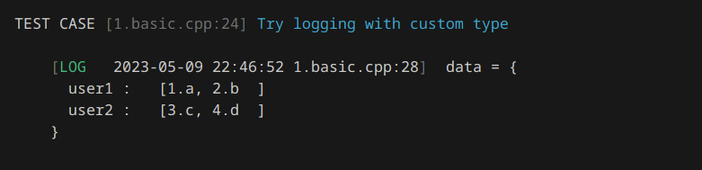

# ZeroErr 零误框架

[](https://en.wikipedia.org/wiki/C%2B%2B#Standardization) [](https://raw.githubusercontent.com/sunxfancy/zeroerr/master/zeroerr.hpp) [](./Readme.en.md)


Hope you get 0 errors and 0 warnings everyday!


ZeroErr 零误框架是一款轻量级C++单元测试框架，同时也集成了断言库，日志库，打印调试等诸多功能，实现了以上功能的整合与协同工作。既可以选择整体使用，也可以单独使用其中的部分功能。

[项目文档](https://sunxfancy.github.io/zeroerr/zh/) | [English Documentation](https://sunxfancy.github.io/zeroerr/en/)

注：目前项目处于实验阶段，API可能会有较大变动，不建议在生产环境中使用。

## 为何要开发一款新的测试框架

目前业界主流的测试框架，Catch2, doctest, Boost.Test, cpputest 功能完善成熟，基本满足大多数应用场景。glog，spdlog等日志库使用也很简便。但这其中还存在一些问题：


### 1. 泛型打印支持

以上主流框架对任意类型数据的打印支持不够，大多数测试框架，断言库，日志库，大多缺乏泛型打印支持，对于容器和用户自定义类型缺乏直接打印的能力，ZeroErr解决了这一问题。

```c++
TEST_CASE("Try logging") {
    std::vector<int> data = {1, 2, 3};
    LOG_IF(1 == 1, "data = {data}", data);
}
```

类似于其他C++单元测试框架，ZeroErr可以将这段宏注册的单元测试代码编译成自动运行的函数，执行后结果如下，这里我们无需定义任何规则，就可以使用LOG宏打印`vector`模板：


对于带有 `std::ostream& operator<<(std::ostream&, Type)` 流输出重载的自定义类型，可以不加修改直接打印。并且还支持容器类型的嵌套。

```c++
struct Node {
    std::string name;
    int id;
};

std::ostream& operator<<(std::ostream& out, Node n) {
    out << n.id << '.' << n.name;
    return out;
}

TEST_CASE("Try logging with custom type") {
    std::map<std::string, std::vector<Node>> data = {
        {"user1", {{"a",1}, {"b",2}}}, {"user2", {{"c",3}, {"d",4}}}
    };
    LOG("data = {data}", data);
}
```




当然，很多情况下，第三方库并没有重载我们预期的`<<`操作符。对于较复杂的情况，我们可以编写泛型打印函数来处理，这大大增强了系统对不同接口的处置能力。例如，我们对这个LLVM的 `llvm::Function*` 类型，可以使用如下方式用`dbg`函数打印，这里`dbg`类似于rust的`dbg`宏，用来快速打印检查任意类型，并且可以嵌套使用：

```c++
namespace zeroerr { // must defined in namespace zeroerr

template <typename T>
typename std::enable_if<
    std::is_base_of<llvm::Value, T>::value || std::is_base_of<llvm::Type, T>::value, void>::type
PrinterExt(Printer& P, T* s, unsigned level, const char* lb, rank<2>) {
    if (s == nullptr) {
        P.os << P.tab(level) << "nullptr" << lb;
    } else {
        llvm::raw_os_ostream os(P.os);
        s->print(os);
    }
}
}

TEST_CASE("customize printing of LLVM pointers") {
    llvm::LLVMContext        context;
    std::vector<llvm::Type*> args   = {llvm::Type::getInt32Ty(context)};
    llvm::Module*            module = new llvm::Module("test_module", context);

    auto* f =
        llvm::Function::Create(llvm::FunctionType::get(llvm::Type::getVoidTy(context), args, false),
                               llvm::GlobalValue::ExternalLinkage, "test", module);
    dbg(dbg(f)->getType());
}
```

这个泛型函数会匹配所有基类为`Value`和`Type`的llvm类，然后打印时创建一个`llvm::raw_os_ostream`输出流，并对其进行调用`print`方法打印。


### 2. 断言、日志、单元测试的联合使用

对于使用多个不同的库实现上述功能，断言、日志、单元测试的各种功能无法协同使用。而在ZeroErr中，断言出错时，可以被日志系统捕获，可以输出到文件中保存，断言在单元测试中，可以被报告系统记录，并在最终输出中统计共有哪些断言失败。上述功能可以联合使用，也可以单独使用某一项，用法非常灵活。

```c++
int fib(int n) {
    REQUIRE(n >= 0, "n must be non-negative");
    REQUIRE(n < 20, "n must be less than 20");
    if (n <= 2) {
        return 1;
    }
    return fib(n - 1) + fib(n - 2);
}

TEST_CASE("fib function test") {
    CHECK(fib(0) == 0);
    CHECK(fib(1) == 1);
    CHECK(fib(2) == 1);
    CHECK(fib(3) == 2);
    CHECK(fib(4) == 3);
    CHECK(fib(5) == 5);
    CHECK(fib(20) == 6765);
}
```


更进一步，单元测试甚至可以通过比较log结果是否与之前正确的结果相同，从而避免很多复杂的单元测试编写，粗略检查代码的正确性。


```c++
TEST_CASE("match ostream") {
    // match output can be done in the following workflow
    // 1. user mark the test case which are comparing output use 'have_same_output'
    // 2. If the output is not exist, the result has been used as a correct verifier.
    // 3. If the output is exist, compare with it and report error if output is not match.
    std::cerr << "a = 100" << std::endl;

    ZEROERR_HAVE_SAME_OUTPUT;
}
```
通过设置 `ZEROERR_HAVE_SAME_OUTPUT` 宏，系统会自动检查该测试点的output stream输出，第一次执行时的结果会自动保存起来，而之后每次执行，都会将输出与第一次输出进行对比，相同则正确，否则该点错误。用户可以第一次手动观察输出是否符合预期，若是修改了实现后，想清除保存的结果，只需要将测试目录下的 `output.txt` 缓存文件删除即可。(目前仍是实验功能)


最后，对于日志系统，单元测试不但能够访问日志数据，以确保函数按照预期逻辑执行出来了结果。
还可以在逻辑出错时，自动捕获函数中的断言和相关打印信息，以便于后续的调试。

```c++
118 static void function() {
119    LOG("function log {i}", 1);  
120    LOG("function log {sum}, {i}", 10, 1);
121 }
...

TEST_CASE("access log in Test case") {
    zeroerr::suspendLog();
    function();
    CHECK(LOG_GET(function, 119, i, int) == 1);
    CHECK(LOG_GET(function, 120, sum, int) == 10);
    CHECK(LOG_GET(function, 120, i, int) == 1);
    zeroerr::resumeLog();
}
```

为了访问log，我们首先要暂停log系统，避免数据被输出到文件中，然后调用函数，通过`LOG_GET`宏访问log中的数据，最后再恢复log系统的运行。(目前，暂时仅能获取到每个Log点第一次调用的数据，仍是实验功能)。


## 项目构建

本项目使用CMake构建，您可以直接将整个目录引入为子项目，也可以选择下载我们提前打包好的整合文件 `zeroerr.hpp`。项目的构建可以在项目根目录下使用如下指令：

```sh
mkdir build
cmake -DCMAKE_BUILD_TYPE=Release -B ./build -S .
cmake --build ./build
```

可选的构建参数

| 构建参数           | 选项              | 含义                                 |
| ------------------ | ----------------- | ------------------------------------ |
| COLORFUL_OUTPUT    | **AUTO**, ON, OFF | 采用彩色输出，此功能依赖特定操作系统 |
| ENABLE_THREAD_SAFE | **ON**, OFF       | 启用线程安全支持                     |
| ENABLE_AUTO_INIT   | **ON**, OFF       | 自动在进程启动时初始化一些环境检测   |
| USE_MOLD           | ON, **OFF**       | 使用 mold linker 链接                |
| BUILD_EXAMPLES     | **ON**, OFF       | 构建示例代码                         |


